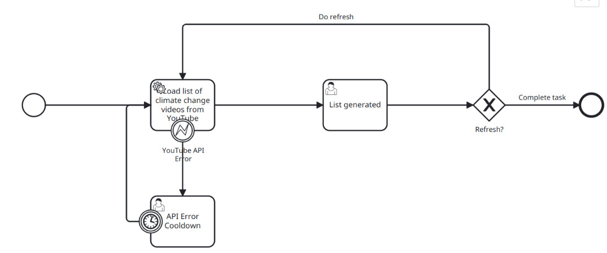

# Climate Change Videos Camunda Setup

## Setup
Rename `application.properties.example` to `aplication.properties` and set your YouTube API Key.

## Run

```sh
// Run Comunda Run via docker-compose.yml
docker-compose up

// Run the external Spring worker via Maven
mvn spring-boot:run
```

## Functionality



This application provides a Camunda Process that collects a list of YouTube videos about climate change.

It consists of a Spring worker that will auto-deploy the processes and forms on startup.

After starting the process, a service task will be executed by the worker. It fetches a list of 25 YouTube videos from the official API and formats them to HTML. It then sends the HTML back to Camunda which displays the videos to the user (Note: This might not be an optimal way to store the data, but it's a trade-off to complete the given task. As of now, we don't do anything further with the list, so it does not break functionality).

If the user wants to, they can choose to refresh the list again or end the task.

If the YouTube API fails to fetch the videos, an error event will be send by the worker and the service task will be retried (there is no back-off/retry limit mechanism implemented, careful).

Another deficit is that the list is non-filterable, which means that climate change denier videos could be in the list with no way of removing them.